### Overview

Red Hat® Ansible® Automation Platform advanced deployment lab

### Overall Architecture

### Outline of work flow

- provision infrastucrture include (frontend1, app1, app2, appdb1)
- setup dns using user_data
- test connection via control node with other hosts
- setup yum repos (via satellite)
- install postgres 10
- setup postgres for remote password, listing port, user, password
- setup application
- install flask application
- setup haproxy for loadbalancer application
- run smoke test application

### Projects setup

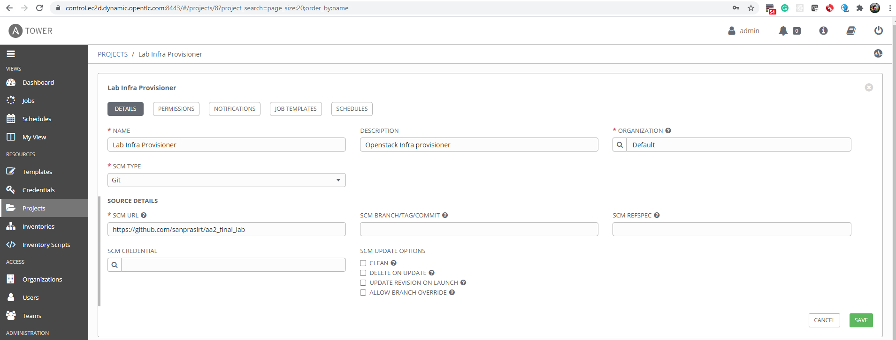

### Ansible Tower Listing all the job templates

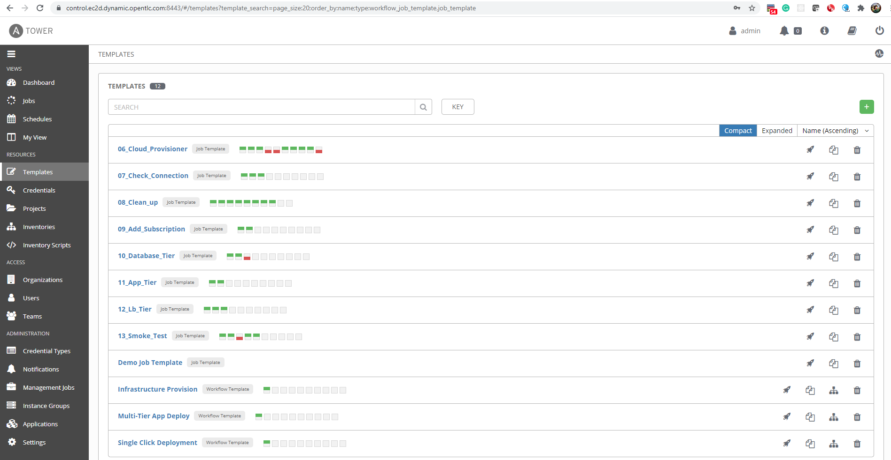

#### Jobs Template Detail

- 06_Cloud_Provisioner
  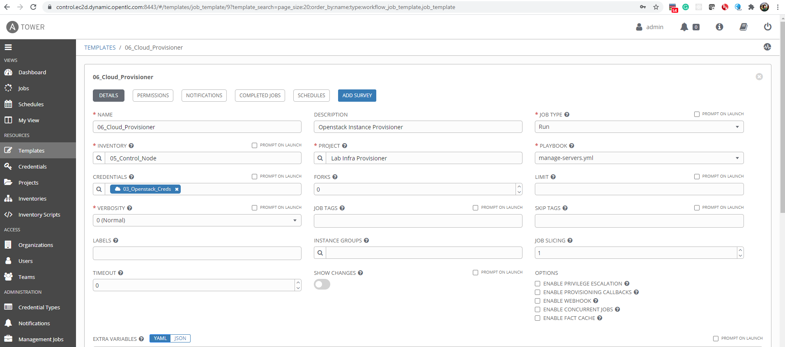
- 07_Check_Connection
  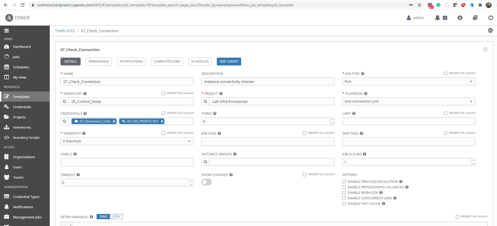
- 08_Clean_up
  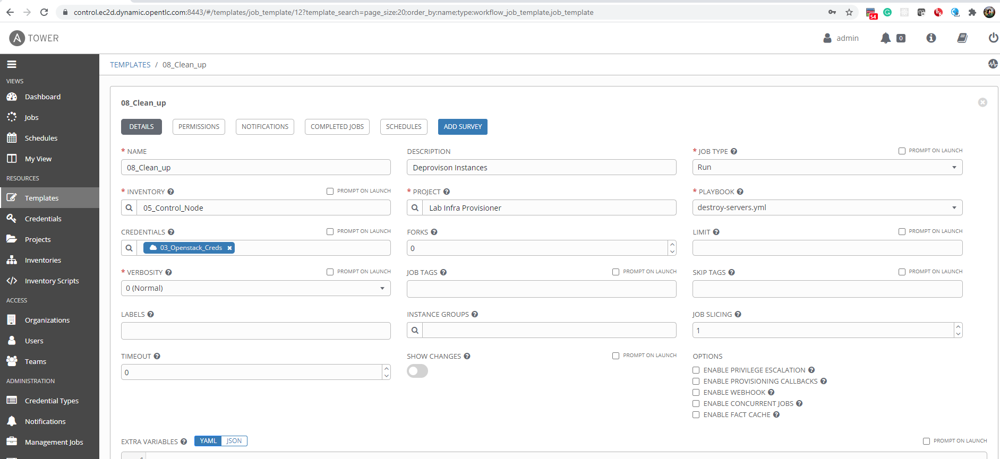
- 09_Add_Subscription
  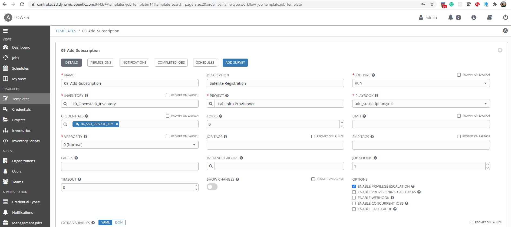
- 10_Database_Tier
  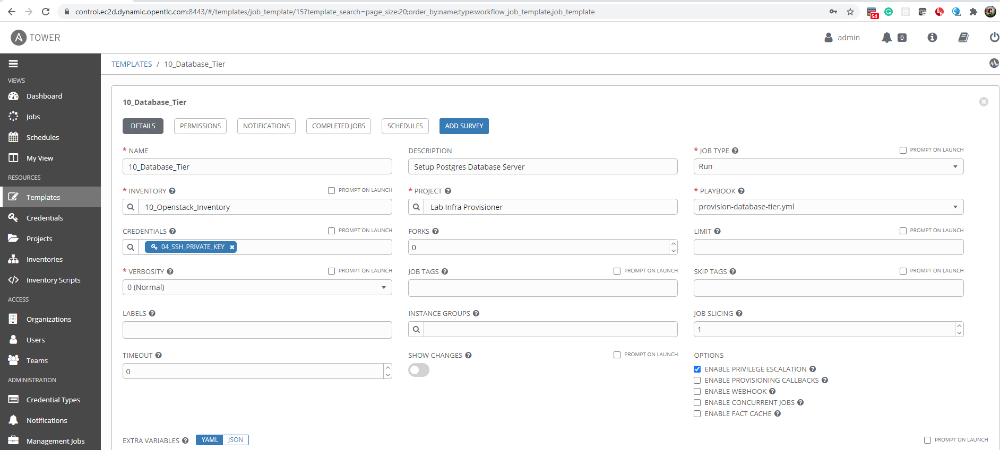
- 11_App_Tier
  
- 12_Lb_Tier
  
- 13_Smoke_Test
  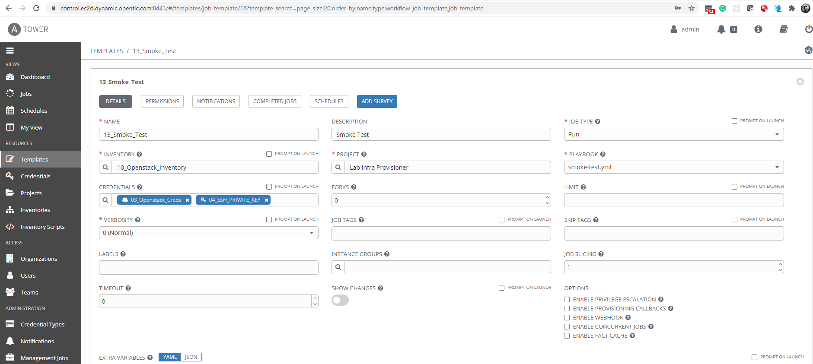

### Ansible Tower Workflow

#### Infrastructure Provision Workflow

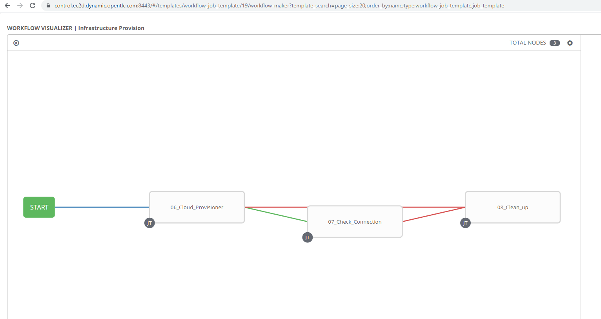

#### Multi-tier Applicaton Workflow

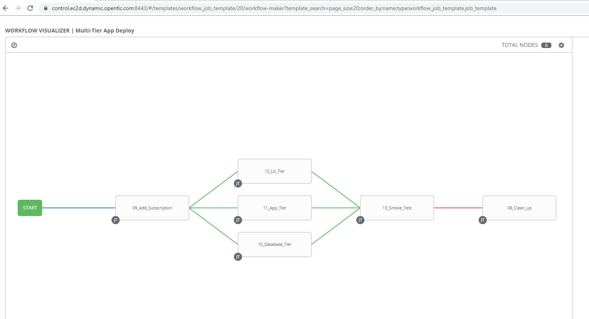

#### Nested Workflow

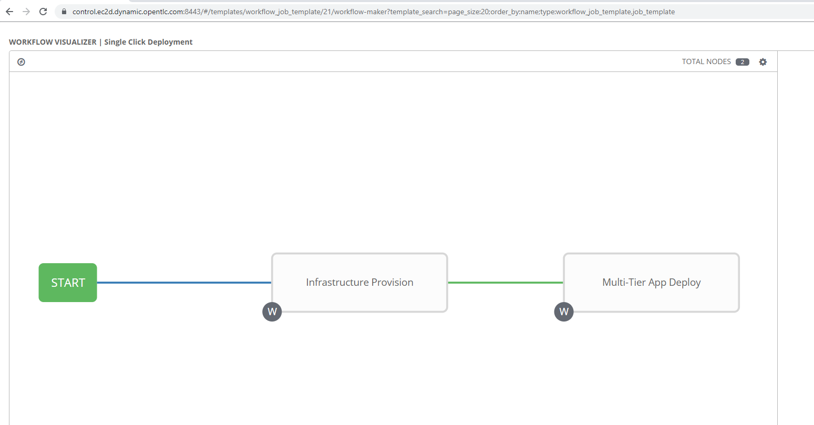
